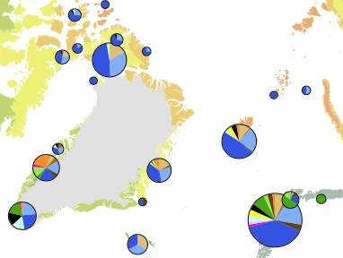
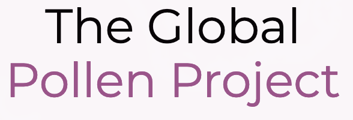

### My Projects in Ecology and Biodiversity Science

I am a long-term ecologist working at the intersection of evidence-based approaches, long-term biodiversity responses to environmental change, and functional programming.

| Tools and Libraries |  |  |
| ------------- | ------------- | --- |
|  | **Bristlecone** is an F# library for model-fitting model-selection (MFMS) of ecological models to observational data. The library was developed for tree ring analysis, but can be used for other time-series modelling problems. | [docs](https://acm.im/bristlecone) |
|  | **Ecoset** is a simple and flexible typescript app to serve geo-temporal datasets using tools such as GDAL. | |
|  | **Thalloo** (pronounced tol-oo) is a template for geographical mapping and data exploration of *systematic maps* and *systematic reviews*. As a Jekyll template, the starter template may be used to make a github pages static site for exploring evidence maps. | [Starter template](https://github.com/AndrewIOM/thalloo-starter/) |
| RProvider (*Maintainer*) | RProvider is an interop layer for F# to R for scientific computing. | [docs](https://fslab.org/RProvider/) |

| Web Apps  |  |  |
| ------------- | ------------- | --- |
|  |  The **Global Pollen Project** is a web app for paleoecology. It aids the digitisation of pollen reference material and crowdsourced identification of unidentified pollen grains. | [globalpollenproject.org](https://globalpollenproject.org) |
|   | The **Local Ecological Footprint Tool (LEFT)** is a web-based decision support tool which can help businesses minimise the environmental impacts of their activities when they make decisions about how land is used. | [left.ox.ac.uk](https://left.ox.ac.uk) [marineleft.ox.ac.uk](https://marineleft.ox.ac.uk) |
